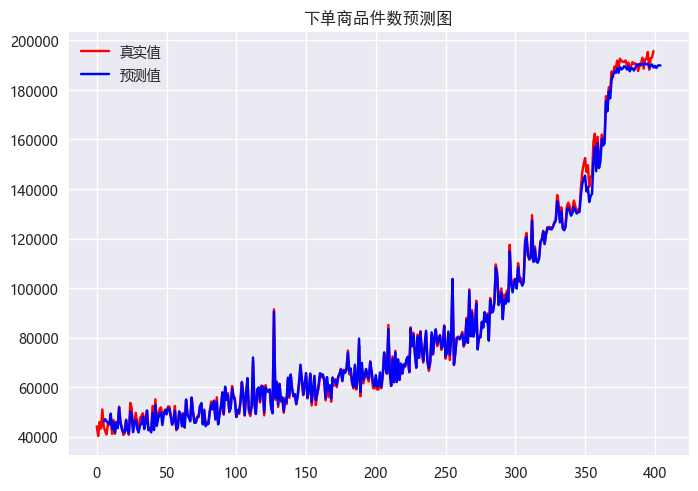
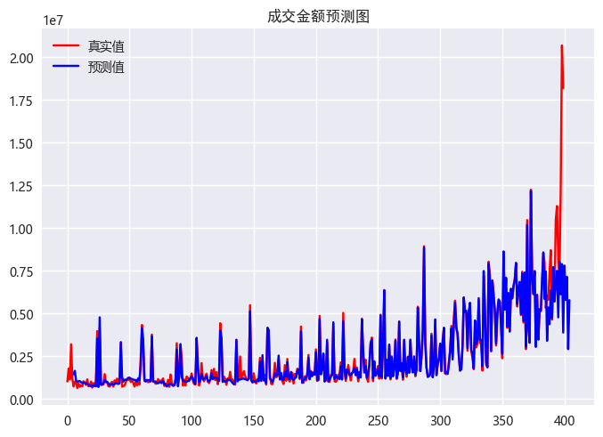

# Sales Predict With LSTM

This project involves using multi-layer LSTMs to predict the sales problem.

## 1. Dataset Description

| **Column** | **Type** |                                                                          **Meaning**                                                                           |
|:----------:|:--------:|:--------------------------------------------------------------------------------------------------------------------------------------------------------------:|
|     日期     |   date   |                                                                     time of data recording                                                                     |
|    浏览量     |   int    |                                               the number of times users view the page on the e-commerce platform                                               |
|    访客数     |   int    |                                                        the number of users to e-commerce platform pages                                                        |
|   人均浏览量    |  float   |                                     the average number of times every user views a page on an e-commerce platform in a day                                     |
|   平均停留时间   |  float   |                                                          the average time spent by users on the page                                                           |
|    跳失率     |  float   | the proportion of visits where users enter through the corresponding portal and leave after visiting only one page to the total number of visits to that page  |
|   成交客户数    |   int    |                                                         the number of customers who successfully paid                                                          |
|    成交单量    |   int    |                                                             the number of orders successfully paid                                                             |
|    成交金额    |   int    |                                                            the total amount of successful payments                                                             |
|    客单价     |  float   |                                                         the average amount of goods purchased per user                                                         |
|   成交商品件数   |   int    |                                                           the number of goods successfully paid for                                                            |
|   下单客户数    |   int    |                                                         the number of customers who have placed orders                                                         |
|    下单单量    |   int    |                                                                  the number of orders placed                                                                   |
|    下单金额    |   int    |                                                               the total amount of orders placed                                                                |
|   下单商品件数   |   int    |                                                                  the number of goods ordered                                                                   |

## 2. Prepare configuration file

### (1) Dataset parameters

* **feature_columns** : `columns used as features in the csv dataset, with columns numbered 0, 1, 2,···`
* **label_columns** : `columns used as labels in the csv dataset, with columns numbered 0, 1, 2,···`
* **predict_day** : `predict how many days in the future`

### (2) Network parameters

* **input_size** : `the size of input layer, that is, the number of columns used as features`
* **output_size** :  `the size of output layer, that is, the number of columns used as labels`
* **hidden_size** : `the size of hidden layer`
* **lstm_layers** : `the number of layers of lstm`
* **dropout_rate** : `dropout probability`
* **time_step** : `how many days before to predict the next day`

### (3) Training parameters

* **do_train** : `whether to train the model`
* **do_predict** : `whether the model is used for prediction`
* **add_train** : `whether to continue training on the trained weights`
* **shuffle_train_data** : `whether to randomly disrupt the training data`
* **use_cuda** : `whether to use GPU training`
* **train_data_rate** : `the ratio of training data to total data`
* **valid_data_rate** : `the ratio of validation data to training_data`
* **batch_size** : `the number of samples passed to the model for training in a epoch`
* **learning_rate** : `learning rate`
* **epoch** : `the number of times the model is trained `
* **patience** : `how many epochs to train and stop if the validation set does not improve `
* **random_seed** : `random seed, guaranteed reproducible`
* **do_continue_train** : `take the final state of the previous training as the next init state for each training`

### (4) Training mode

* **debug_mode** : ` In debugging mode, it is to run through the code and pursue speed`
* **debug_num** : `debugging with only debug_num pieces of data`

### (5) Path Parameters

* **train_data_path** : `dataset save path`
* **model_save_path** : `model weights save path`
* **figure_save_path** : `prediction result save path`
* **log_save_path** : `training log save path`
* **do_log_print_to_screen** : `whether to display the log and training process on the screen`
* **do_log_save_to_file** : `whether to record the config and training process`
* **do_figure_save** : `whether to save the prediction result image`
* **do_train_visualized** : `training loss visualization`

## 3. Display of operation results

* Prediction of the number of items ordered

    

* Prediction of transaction amount

    
