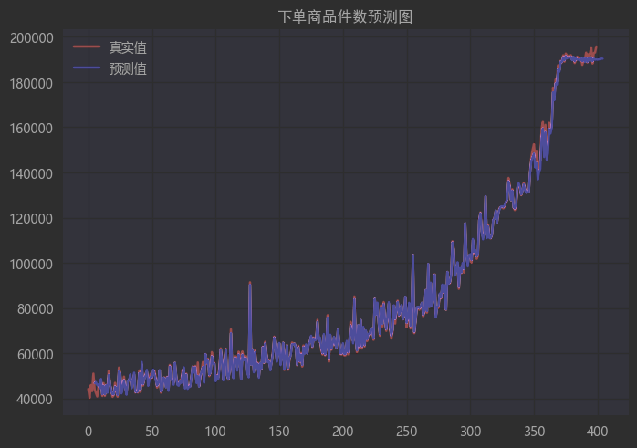
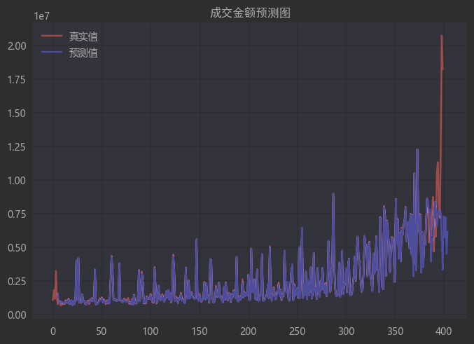

# Sales Predict With LSTM

Use multi-layer LSTM to predict the merchandise sales process

## Dataset Description

| **Column** | **Type** |               **Meaning**               |
|:----------:|:--------:|:---------------------------------------:|
|     日期     |   date   |                  具体时间                   |
|    浏览量     |   int    |             用户在电商平台页面上查看的次数             |
|    访客数     |   int    |              电商平台页面的访问者数量               |
|   人均浏览量    |  float   |          一天内用户平均在电商平台页面上查看的次数           |
|   平均停留时间   |  float   |             访问者浏览页面所花费的平均时长             |
|    跳失率     |  float   | 用户通过相应入口进入，只访问了一个页面就离开的访问次数占该页面总访问次数的比例 |
|   成交客户数    |   int    |                成功付款的客户数                 |
|    成交单量    |   int    |                成功付款的订单数量                |
|    成交金额    |   int    |                成功付款的总金额                 |
|    客单价     |  float   |              每个用户平均购买商品的金额              |
|   成交商品件数   |   int    |                成功付款的商品件数                |
|   下单客户数    |   int    |                已下订单的客户数                 |
|    下单单量    |   int    |                已下订单的订单数量                |
|    下单金额    |   int    |                已下订单的总金额                 |
|   下单商品件数   |   int    |                已下订单的商品件数                |

## Prepare configuration file

### Dataset parameters

* **feature_columns** : `csv数据集中用作特征的列，列的编号为0，1，2，···`
* **label_columns** : `csv数据集中用作标签的列，列的编号为0，1，2，···`
* **predict_day** : `预测未来多少天`

### Network parameters

* **input_size** : `输入层尺寸，即用作特征的列的个数`
* **output_size** :  `输出层尺寸，即用作标签的列的个数`
* **hidden_size** : `隐藏层尺寸`
* **lstm_layers** : `LSTM的层数`
* **dropout_rate** : `Dropout的概率`
* **time_step** : `LSTM中的time_step,即用前多少天的数据来预测后一天`

### Training parameters

* **do_train** : `是否训练模型`
* **do_predict** : `模型是否用作预测`
* **add_train** : `是否在已训练好的权重上继续训练`
* **shuffle_train_data** : `是否随机打乱训练数据`
* **use_cuda** : `是否使用GPU训练`
* **train_data_rate** : `训练数据占总体数据比例`
* **valid_data_rate** : `验证数据占训练数据比例`
* **batch_size** : `单次传递给模型用以训练的样本个数`
* **learning_rate** : `学习率`
* **epoch** : `模型训练次数`
* **patience** : `训练多少epoch，验证集没提升就停掉`
* **random_seed** : `随机种子，保证可复现`
* **do_continue_train** : `每次训练把上一次的final_state作为下一次的init_state`

### Training mode

* **debug_mode** : `调试模式下，是为了跑通代码，追求快`
* **debug_num** : `仅用debug_num条数据来调试`

### Path Parameters

* **train_data_path** : `数据集保存位置`
* **model_save_path** : `模型权重保存位置`
* **figure_save_path** : `预测结果图片保存位置`
* **log_save_path** : `训练记录保存位置`
* **do_log_print_to_screen** : `是否将config和训练过程在屏幕显示`
* **do_log_save_to_file** : `是否将config和训练过程记录到log`
* **do_figure_save** : `是否保存预测结果图片`
* **do_train_visualized** : `训练loss可视化，pytorch用visdom`

## Display of operation results

* Prediction of the number of items ordered

* Prediction of transaction amount

